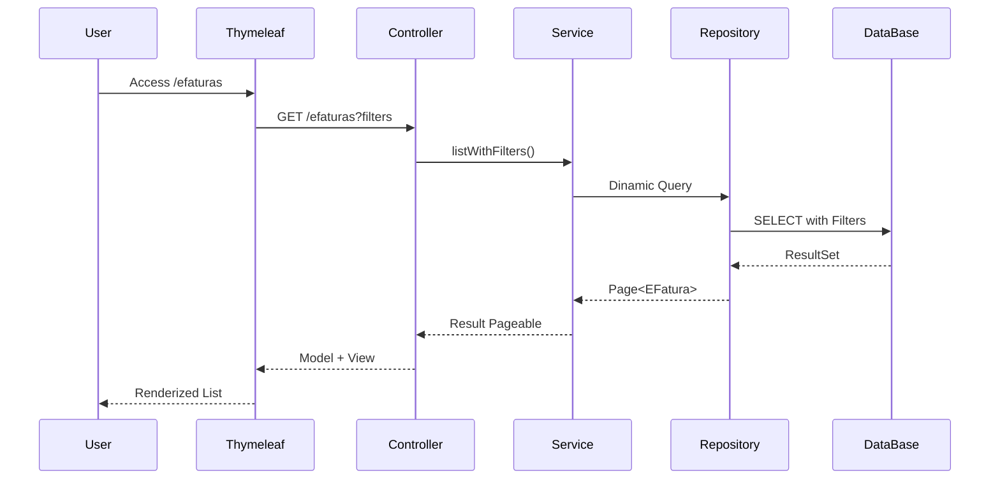

### 📋 Description
This requirement defines the visualization of imported financial data,
providing dynamic filters, pagination, and a web interface built with Thymeleaf.

---

### 🎯 Objective
Deliver a clear and efficient user experience for financial data analysis.

---

### ⚔️ Features
- Dynamic filters
- Paginated results
- Optimized queries
- User-friendly UI

---

- ## Fluxo de Interação

### 🖥️ Technologies
- Spring MVC
- Thymeleaf
- Spring Data JPA
- PostgreSQL
