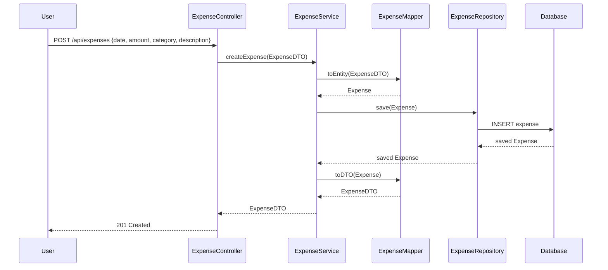
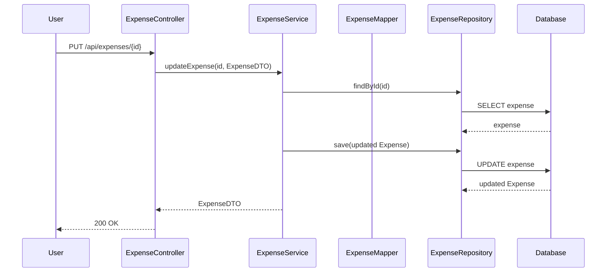
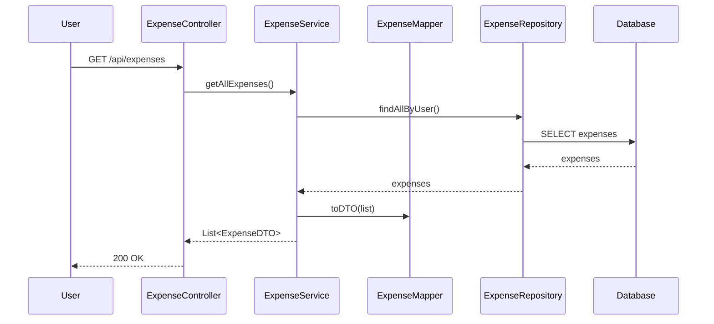
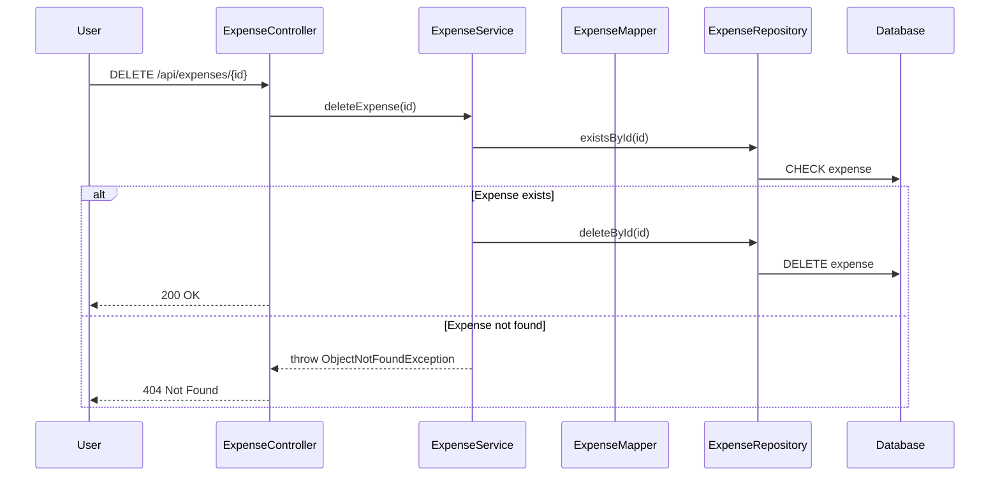

### 📈 HTTPS POST EXPENSE:

```mermaid
sequenceDiagram
    participant U as User
    participant C as ExpenseController
    participant S as ExpenseService
    participant M as ExpenseMapper
    participant R as ExpenseRepository
    participant DB as Database

    %% CREATE EXPENSE
    U->>C: POST /api/expenses {date, amount, category, description}
    C->>S: createExpense(ExpenseDTO)
    S->>M: toEntity(ExpenseDTO)
    M-->>S: Expense
    S->>R: save(Expense)
    R->>DB: INSERT expense
    DB-->>R: saved Expense
    R-->>S: saved Expense
    S->>M: toDTO(Expense)
    M-->>S: ExpenseDTO
    S-->>C: ExpenseDTO
    C-->>U: 201 Created
```
---
### 📈 HTTPS PUT EXPENSE:

```mermaid
sequenceDiagram
    participant U as User
    participant C as ExpenseController
    participant S as ExpenseService
    participant M as ExpenseMapper
    participant R as ExpenseRepository
    participant DB as Database

 %% UPDATE EXPENSE
    U->>C: PUT /api/expenses/{id}
    C->>S: updateExpense(id, ExpenseDTO)
    S->>R: findById(id)
    R->>DB: SELECT expense
    DB-->>R: expense
    S->>R: save(updated Expense)
    R->>DB: UPDATE expense
    DB-->>R: updated Expense
    S-->>C: ExpenseDTO
    C-->>U: 200 OK
```
---
### 📈 HTTPS GET (LIST) EXPENSE:

```mermaid
sequenceDiagram
    participant U as User
    participant C as ExpenseController
    participant S as ExpenseService
    participant M as ExpenseMapper
    participant R as ExpenseRepository
    participant DB as Database

%% LIST EXPENSES
    U->>C: GET /api/expenses
    C->>S: getAllExpenses()
    S->>R: findAllByUser()
    R->>DB: SELECT expenses
    DB-->>R: expenses
    R-->>S: expenses
    S->>M: toDTO(list)
    S-->>C: List<ExpenseDTO>
    C-->>U: 200 OK
```
---
### 📈 HTTPS DELETE EXPENSE:

```mermaid
sequenceDiagram
    participant U as User
    participant C as ExpenseController
    participant S as ExpenseService
    participant M as ExpenseMapper
    participant R as ExpenseRepository
    participant DB as Database

 %% DELETE EXPENSE
    U->>C: DELETE /api/expenses/{id}
    C->>S: deleteExpense(id)
    S->>R: existsById(id)
    R->>DB: CHECK expense
    alt Expense exists
        S->>R: deleteById(id)
        R->>DB: DELETE expense
        C-->>U: 200 OK
    else Expense not found
        S-->>C: throw ObjectNotFoundException
        C-->>U: 404 Not Found
    end
```
