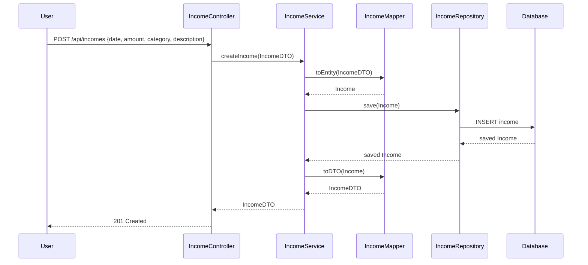
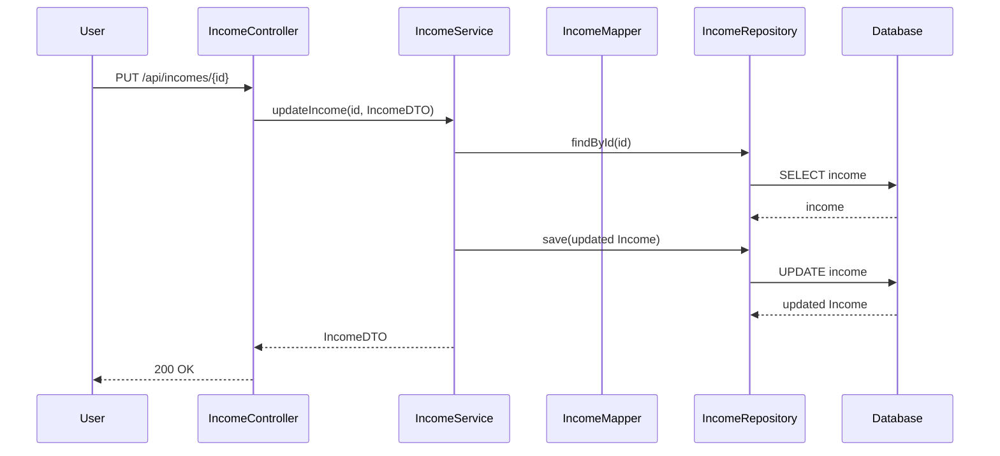
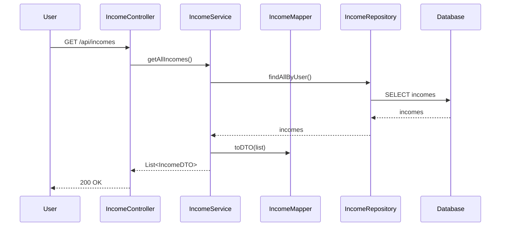
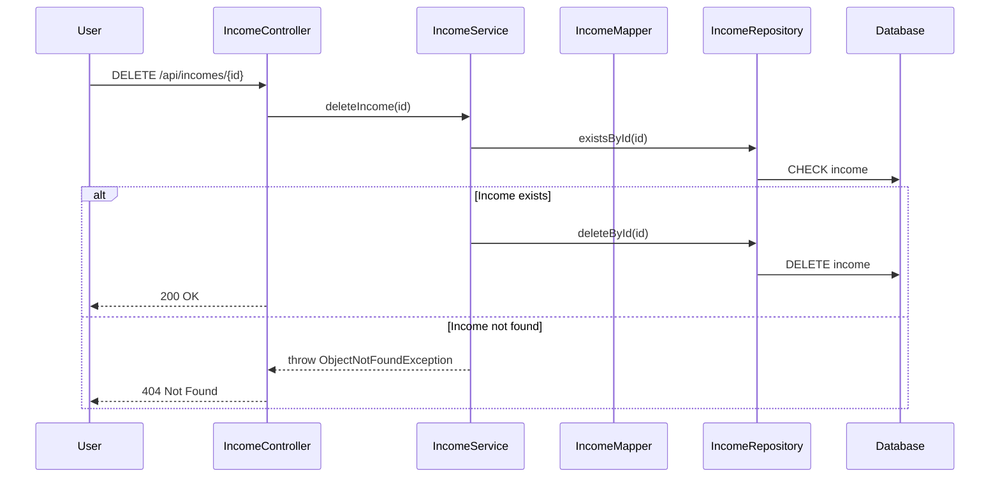

### 📈 HTTPS POST INCOME:

```mermaid
sequenceDiagram
    participant U as User
    participant C as IncomeController
    participant S as IncomeService
    participant M as IncomeMapper
    participant R as IncomeRepository
    participant DB as Database

    %% CREATE INCOME
    U->>C: POST /api/incomes {date, amount, category, description}
    C->>S: createIncome(IncomeDTO)
    S->>M: toEntity(IncomeDTO)
    M-->>S: Income
    S->>R: save(Income)
    R->>DB: INSERT income
    DB-->>R: saved Income
    R-->>S: saved Income
    S->>M: toDTO(Income)
    M-->>S: IncomeDTO
    S-->>C: IncomeDTO
    C-->>U: 201 Created
```
---
### 📈 HTTPS PUT INCOME:

```mermaid
sequenceDiagram
    participant U as User
    participant C as IncomeController
    participant S as IncomeService
    participant M as IncomeMapper
    participant R as IncomeRepository
    participant DB as Database

%% UPDATE INCOME
    U->>C: PUT /api/incomes/{id}
    C->>S: updateIncome(id, IncomeDTO)
    S->>R: findById(id)
    R->>DB: SELECT income
    DB-->>R: income
    S->>R: save(updated Income)
    R->>DB: UPDATE income
    DB-->>R: updated Income
    S-->>C: IncomeDTO
    C-->>U: 200 OK
```
---
### 📈 HTTPS GET (LIST) INCOME:

```mermaid
sequenceDiagram
    participant U as User
    participant C as IncomeController
    participant S as IncomeService
    participant M as IncomeMapper
    participant R as IncomeRepository
    participant DB as Database

%% LIST INCOMES
    U->>C: GET /api/incomes
    C->>S: getAllIncomes()
    S->>R: findAllByUser()
    R->>DB: SELECT incomes
    DB-->>R: incomes
    R-->>S: incomes
    S->>M: toDTO(list)
    S-->>C: List<IncomeDTO>
    C-->>U: 200 OK
```
---
### 📈 HTTPS DELETE INCOME:

```mermaid
sequenceDiagram
    participant U as User
    participant C as IncomeController
    participant S as IncomeService
    participant M as IncomeMapper
    participant R as IncomeRepository
    participant DB as Database

 %% DELETE INCOME
    U->>C: DELETE /api/incomes/{id}
    C->>S: deleteIncome(id)
    S->>R: existsById(id)
    R->>DB: CHECK income
    alt Income exists
        S->>R: deleteById(id)
        R->>DB: DELETE income
        C-->>U: 200 OK
    else Income not found
        S-->>C: throw ObjectNotFoundException
        C-->>U: 404 Not Found
    end
```
