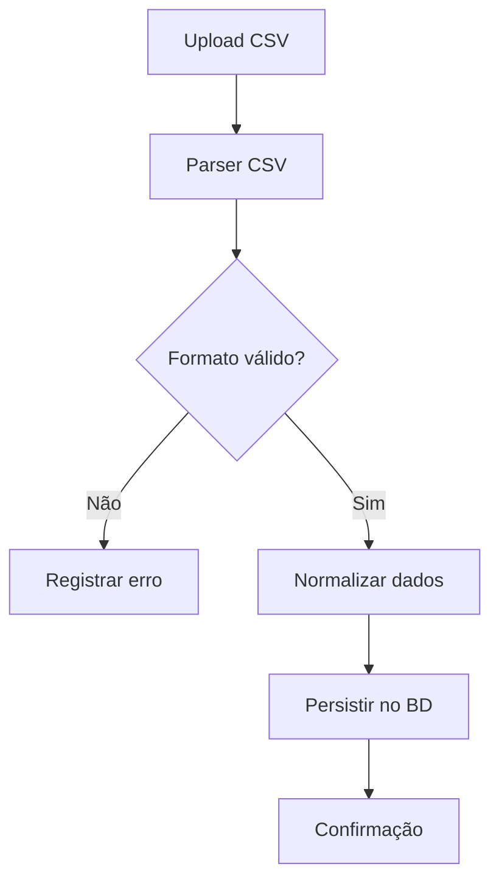

# RF02 – Importação de Dados via CSV

## Descrição
Este requisito funcional define o processo de importação de dados financeiros a partir de arquivos CSV,
realizando parsing, validação, normalização e persistência no banco de dados relacional.

## Objetivo
Permitir que dados externos sejam integrados ao sistema de forma segura, consistente e auditável.

## Fluxo Funcional
1. Upload do arquivo CSV
2. Leitura linha a linha
3. Validação de estrutura e campos obrigatórios
4. Normalização dos dados
5. Persistência no banco
6. Registro de erros (quando aplicável)

## Diagrama de Fluxo

