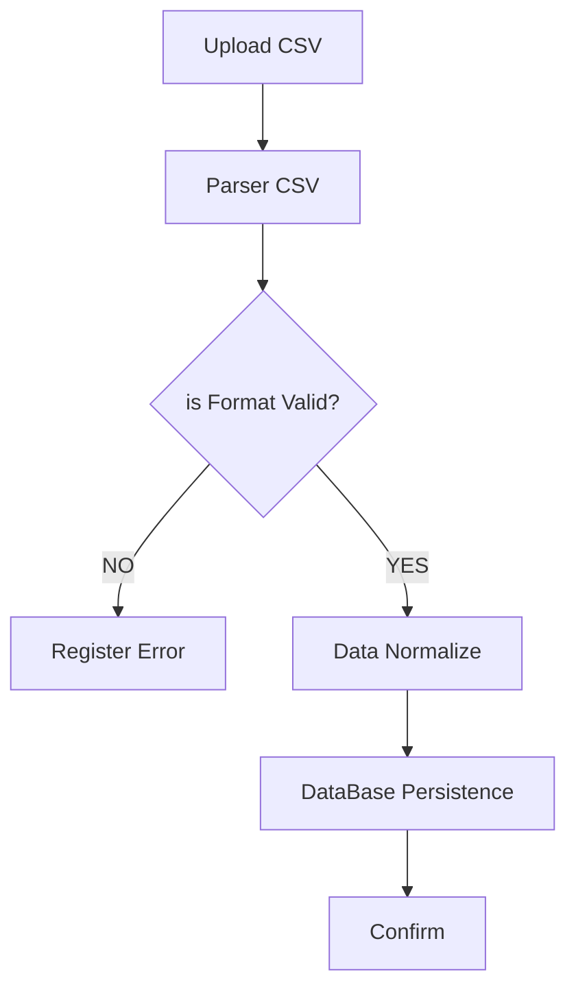

###  📋 Description
This functional requirement defines the process of importing financial data from CSV files,
including parsing, validation, normalization, and persistence into a relational database.

---

### 🎯 Objective
Enable the secure and consistent integration of external data sources into the system.

---

###  🔁 Functional Flow
1. CSV file upload
2. Line-by-line parsing
3. Structure and field validation
4. Data normalization
5. Database persistence
6. Error logging

7. ## 🔁 Diagrama de Fluxo

---

### 💻 Technologies
- Java 17
- Spring Boot
- JPA / Hibernate
- PostgreSQL
