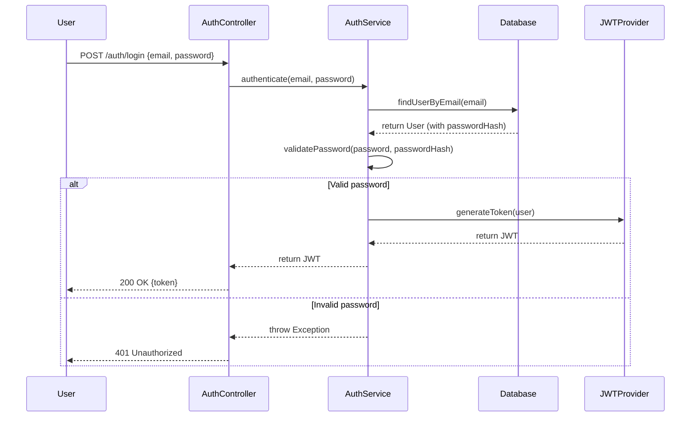

```mermaid
sequenceDiagram
    participant U as User
    participant C as AuthController
    participant S as AuthService
    participant DB as Database
    participant J as JWTProvider

    U->>C: POST /auth/login {email, password}
    C->>S: authenticate(email, password)
    S->>DB: findUserByEmail(email)
    DB-->>S: return User (with passwordHash)
    S->>S: validatePassword(password, passwordHash)
    alt Valid password
        S->>J: generateToken(user)
        J-->>S: return JWT
        S-->>C: return JWT
        C-->>U: 200 OK {token}
    else Invalid password
        S-->>C: throw Exception
        C-->>U: 401 Unauthorized
    end

```
