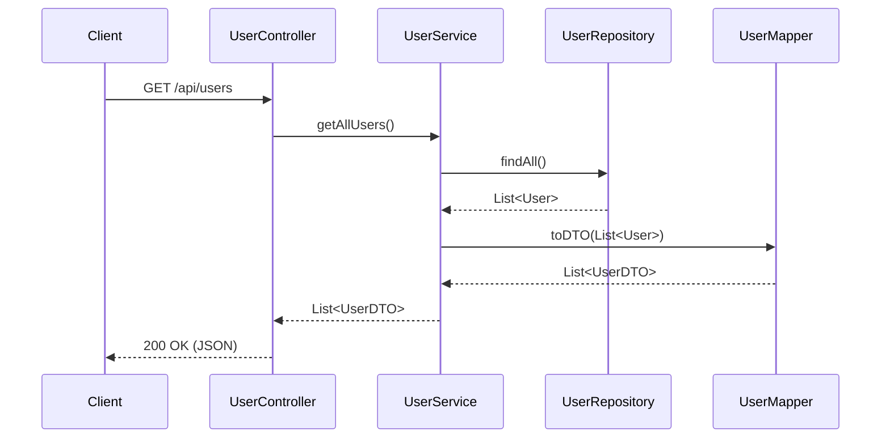
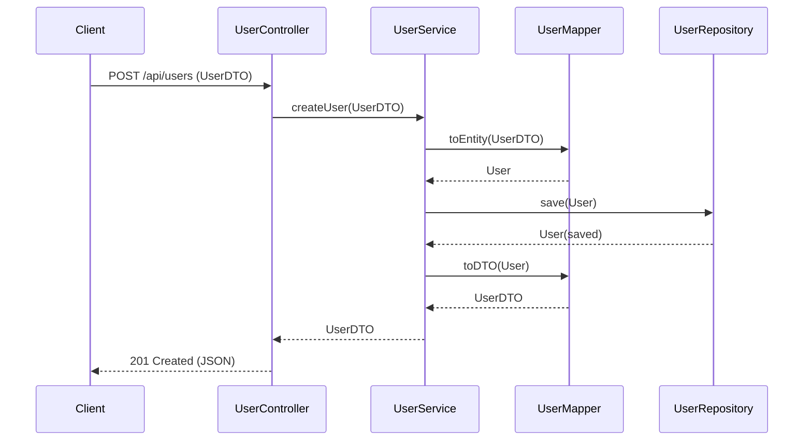
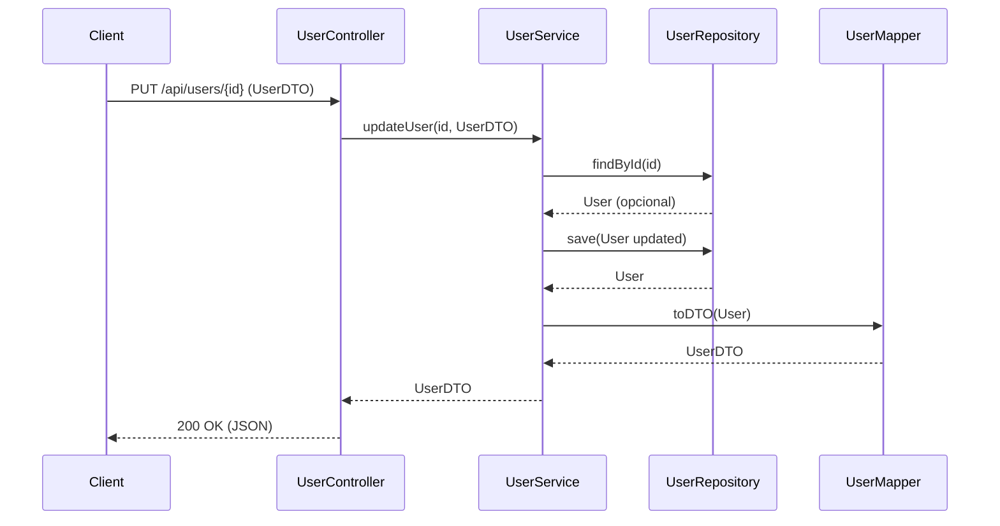
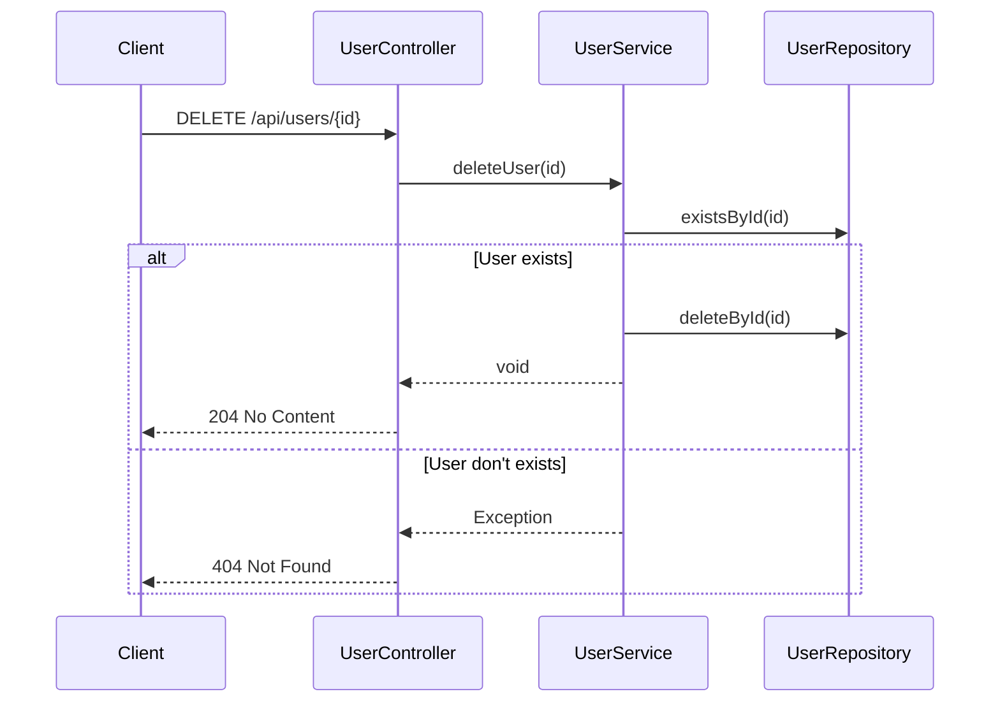

### 📥 HTTPS GET USER:

```mermaid
sequenceDiagram
    participant C as Client
    participant UC as UserController
    participant US as UserService
    participant UR as UserRepository
    participant UM as UserMapper

    C->>UC: GET /api/users
    UC->>US: getAllUsers()
    US->>UR: findAll()
    UR-->>US: List<User>
    US->>UM: toDTO(List<User>)
    UM-->>US: List<UserDTO>
    US-->>UC: List<UserDTO>
    UC-->>C: 200 OK (JSON)
```
---
### 📈 HTTPS POST USER:

```mermaid
sequenceDiagram
    participant C as Client
    participant UC as UserController
    participant US as UserService
    participant UM as UserMapper
    participant UR as UserRepository

    C->>UC: POST /api/users (UserDTO)
    UC->>US: createUser(UserDTO)
    US->>UM: toEntity(UserDTO)
    UM-->>US: User
    US->>UR: save(User)
    UR-->>US: User(saved)
    US->>UM: toDTO(User)
    UM-->>US: UserDTO
    US-->>UC: UserDTO
    UC-->>C: 201 Created (JSON)
```
---
###  📧 HTTPS PUT USER:

```mermaid
sequenceDiagram
    participant C as Client
    participant UC as UserController
    participant US as UserService
    participant UR as UserRepository
    participant UM as UserMapper

    C->>UC: PUT /api/users/{id} (UserDTO)
    UC->>US: updateUser(id, UserDTO)
    US->>UR: findById(id)
    UR-->>US: User (opcional)
    US->>UR: save(User updated)
    UR-->>US: User
    US->>UM: toDTO(User)
    UM-->>US: UserDTO
    US-->>UC: UserDTO
    UC-->>C: 200 OK (JSON)
```
---
###  ❌ HTTPS DELETE USER:

```mermaid
sequenceDiagram
    participant C as Client
    participant UC as UserController
    participant US as UserService
    participant UR as UserRepository

    C->>UC: DELETE /api/users/{id}
    UC->>US: deleteUser(id)
    US->>UR: existsById(id)
    alt User exists
        US->>UR: deleteById(id)
        US-->>UC: void
        UC-->>C: 204 No Content
    else User don't exists
        US-->>UC: Exception
        UC-->>C: 404 Not Found
    end
```
