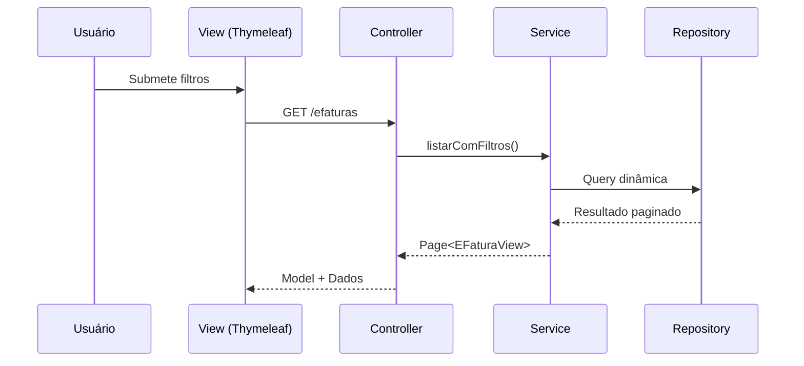

# RF14 – Visualização e Filtros de Dados Financeiros

## 📋 Descrição
Este requisito funcional define a visualização dos dados financeiros importados,
permitindo filtros dinâmicos, paginação e navegação através de interface web baseada em Thymeleaf.

## 🎯 Objetivo
Oferecer ao usuário uma experiência clara e eficiente para análise dos dados financeiros.

## 🔽 Filtros Disponíveis
- Setor
- Tipo
- Situação
- Emitente
- Período (data inicial e final)

## 🔁 Diagrama de Interação

